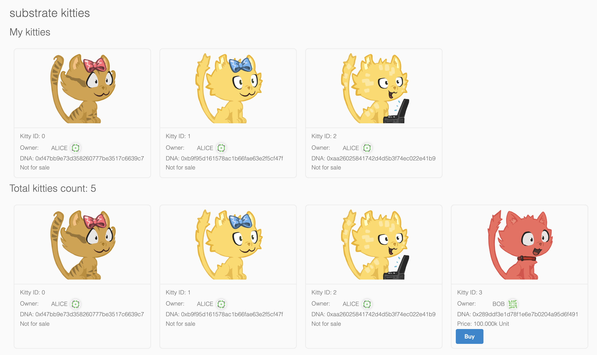

# Substrate Kitties

Substrate Kitties Runtime built with Substrate 1.0.

This is an alternative implementation of Substrate Kitties from [substrate-collectables-workshop](https://github.com/substrate-developer-hub/substrate-collectables-workshop)

Web UI (Please don't abuse it): https://xlc.github.io/kitties-ui/

Telemetry: https://telemetry.polkadot.io/#list/Substrate%20Kitty

Frontend: https://github.com/xlc/kitties-ui



# Building

Install Rust:

```bash
curl https://sh.rustup.rs -sSf | sh
```

Install required tools:

```bash
./scripts/init.sh
```

Build the WebAssembly binary:

```bash
./scripts/build.sh
```

Build all native code:

```bash
cargo build
```

# Run

You can start a development chain with:

```bash
cargo run -- --dev
```

Detailed logs may be shown by running the node with the following environment variables set: `RUST_LOG=debug RUST_BACKTRACE=1 cargo run -- --dev`.

If you want to see the multi-node consensus algorithm in action locally, then you can create a local testnet with two validator nodes for Alice and Bob, who are the initial authorities of the genesis chain that have been endowed with testnet units. Give each node a name and expose them so they are listed on the Polkadot [telemetry site](https://telemetry.polkadot.io/#/Local%20Testnet). You'll need two terminal windows open.

We'll start Alice's substrate node first on default TCP port 30333 with her chain database stored locally at `/tmp/alice`. The bootnode ID of her node is `QmQZ8TjTqeDj3ciwr93EJ95hxfDsb9pEYDizUAbWpigtQN`, which is generated from the `--node-key` value that we specify below:

```bash
cargo run -- \
  --base-path /tmp/alice \
  --chain=local \
  --alice \
  --node-key 0000000000000000000000000000000000000000000000000000000000000001 \
  --telemetry-url ws://telemetry.polkadot.io:1024 \
  --validator
```

In the second terminal, we'll start Bob's substrate node on a different TCP port of 30334, and with his chain database stored locally at `/tmp/bob`. We'll specify a value for the `--bootnodes` option that will connect his node to Alice's bootnode ID on TCP port 30333:

```bash
cargo run -- \
  --base-path /tmp/bob \
  --bootnodes /ip4/127.0.0.1/tcp/30333/p2p/QmQZ8TjTqeDj3ciwr93EJ95hxfDsb9pEYDizUAbWpigtQN \
  --chain=local \
  --bob \
  --port 30334 \
  --telemetry-url ws://telemetry.polkadot.io:1024 \
  --validator
```

Additional CLI usage options are available and may be shown by running `cargo run -- --help`.
